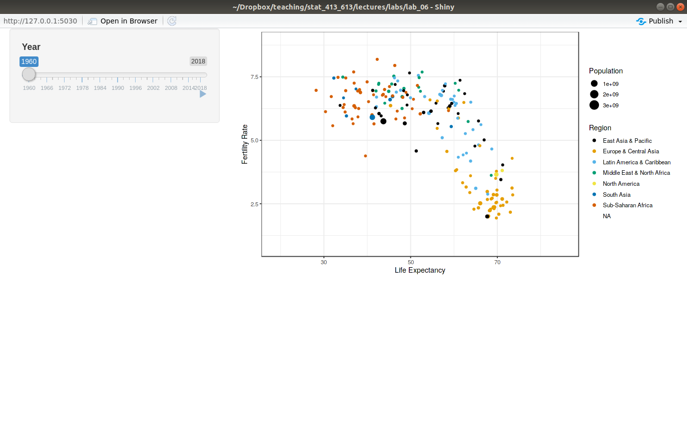

# Instructions

- Create a Shiny app that takes the World Bank data (described below) and plots
  fertility (x-axis) against life expectancy (y-axis), color-coding by
  region and size-annotating by population.
- The user should be able to use a slider to choose the year in which 
  to plot the data.
- The slider should be able to move one year forward every two seconds.
- The axis limits for x and y should remain the same no matter the year chosen.
- Your app should look like this:

    \ 

# World Bank Data

The World Bank is an international organization that
provides loans to countries with the goal of reducing poverty. The following
data frames were all taken from the public data repositories of the World
Bank.

- [country.csv](./data/country.csv): 
  Contains information on the countries in the data set. The
  variables are:
    - `Country_Code`: A three-letter code for the country. Note that not all
      rows are countries; some are regions.
    - `Region`: The region of the country.
    - `IncomeGroup`: Either `"High income"`, `"Upper middle income"`, 
      `"Lower middle income"`, or `"Low income"`.
    - `TableName`: The full name of the country.
- [fertility.csv](./data/fertility.csv): 
  Contains the fertility rate information for each country
  for each year. For the variables `1960` to `2017`, the values in the cells
  represent the fertility rate in total births per woman for the that year. 
  Total fertility rate represents the number of children 
  that would be born to a woman if she were to live to the end of her 
  childbearing years and bear children in accordance with age-specific 
  fertility rates of the specified year.
- [life_exp.csv](./data/life_exp.csv): 
  Contains the life expectancy information for each country 
  for each year. For the variables `1960` to `2017`, the values in the cells
  represent life expectancy at birth in years for the given year. 
  Life expectancy at birth indicates the number of years a newborn 
  infant would live if prevailing patterns of mortality at the time of its
  birth were to stay the same throughout its life.
- [population.csv](./data/population.csv): 
  Contains the population information for each country. For
  the variables `1960` to `2017`, the values in the cells represent the total
  population in number of people for the given year. 
  Total population is based on the de facto definition of
  population, which counts all residents regardless of legal status or 
  citizenship. The values shown are midyear estimates.
